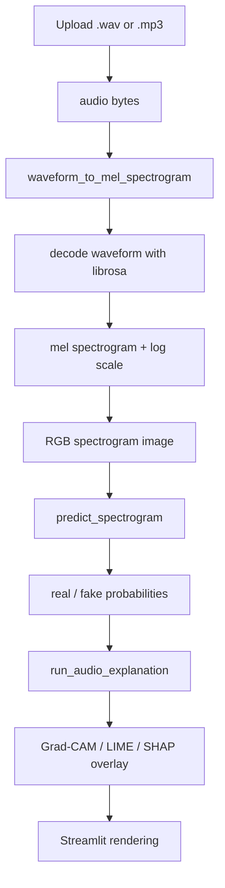
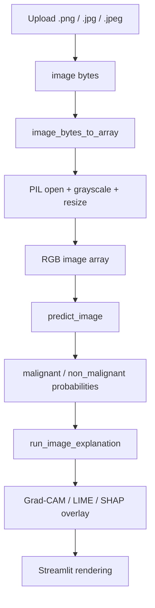

# Pipeline Overview

This document explains, in a compact way, what happens in the app from the moment a user uploads an audio file or a chest X-ray image until the prediction and XAI visualization appear in the interface.

## 1. Common High-Level Flow

Both modalities follow the same high-level structure:

```mermaid
flowchart LR
    A["User input in Streamlit"] --> B["Read uploaded/sample bytes"]
    B --> C["Select model from registry"]
    C --> D["Preprocess input into model-ready array"]
    D --> E["Run model inference"]
    E --> F["Get predicted label + probabilities"]
    F --> G["Dispatch selected explainer(s)"]
    G --> H["Build explanation overlay"]
    H --> I["Render prediction + explanation in UI"]
```

The main difference is the preprocessing stage:

- audio is converted into a mel spectrogram image before inference
- chest X-rays are resized and normalized as images directly

## 2. Audio Pipeline

### Short Explanation

When the user uploads audio:

1. Streamlit reads the uploaded file bytes.
2. The selected model is looked up in the registry.
3. The waveform is decoded with `librosa`.
4. If the source is MP3, it is decoded and treated as WAV/PCM internally.
5. The waveform is transformed into a mel spectrogram.
6. That spectrogram is saved as a 3-channel image array.
7. The selected audio model predicts `real` or `fake`.
8. The selected explainer runs on the spectrogram image used for prediction.
9. The UI displays the prediction, probabilities, spectrogram, and explanation overlay.

### Audio Schema

### Important Detail

The audio explainers do not operate on the raw waveform. They operate on the generated spectrogram image. This is why audio and image workflows are structurally similar inside the XAI stage.

## 3. Chest X-ray Pipeline

### Short Explanation

When the user uploads a chest X-ray:

1. Streamlit reads the uploaded image bytes.
2. The selected model is looked up in the registry.
3. The image is opened with PIL.
4. It is converted to grayscale, resized to the expected input size, then converted back to RGB.
5. The selected image model predicts `malignant` or `non_malignant`.
6. The selected explainer runs on that processed image.
7. The UI displays the prediction, probabilities, processed X-ray, and explanation overlay.

### Image Schema

## 4. How The Explainers Reach The UI

For both modalities, the UI does not compute explanations directly. It:

1. runs inference first
2. gets the predicted label
3. sends the processed array plus the predicted label to the appropriate explanation service
4. receives an explanation image and metadata
5. displays the overlay and the explanation details

This design keeps the Streamlit layer thin and moves the technical logic into service and modality modules.

## 5. Are The Explain methods Really The Same?

The answer is:

- conceptually yes
- implementation-wise, partly separated

The same XAI method families are used in both modalities:

- `Grad-CAM`
- `LIME`
- `SHAP`

But the code is separated into audio and image versions because:

1. the preprocessing is different
2. the model-loading functions are different
3. the prediction callback passed to LIME/SHAP is different
4. the Grad-CAM target layer depends on the selected model architecture

So the project uses the same explainability ideas across both modalities, but each modality has its own adapter code to connect those ideas to the correct model and input representation.

## 6. Practical Interpretation

If the teacher asks whether the explainers are truly shared, the best answer is:

> We use the same XAI method families across both modalities, but we implemented modality-specific wrappers because audio is first converted into a spectrogram image and each model family has different preprocessing, prediction callbacks, and Grad-CAM target layers.

That is the correct technical explanation for the current codebase.
